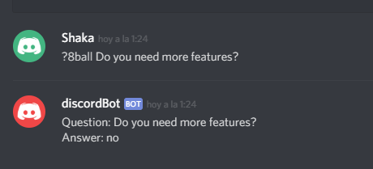
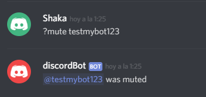
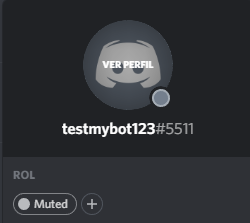
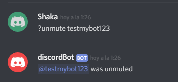
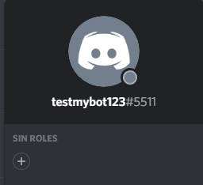
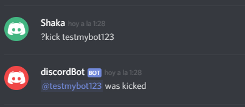
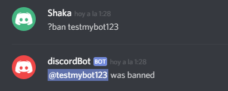
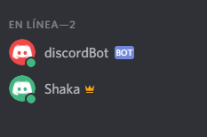

<h1>Discord Bot created with Python</h1>

<h2> Using the Bot </h2>

Requires discord.py library.

First the bot must be online, this is done by executing the Python file.
Once it is online, a message is displayed with the username of the bot and it's status (online) in the server:

 

Interacting with the bot is done with commands that follow a prefix (in this case I used '?').

<h2> Commands available </h2>

Currently the bot has commands to play 8ball game, mute and unmute users, clear messages, display number of users in a server, kick and ban users. These are done in the following way:

<h3> 8Ball game: </h3>

Ask questions to the bot like an 8Ball game (?8ball + question)

 

<h3> Mute and unmute users: </h3>

Mute users, it will set them to a role of the server which doesn't have talking rights (?mute + username)

 

Here you can see the user that was muted as his role was changed by the bot to "Muted".

 

Muted users can also be unmuted again. (?unmute + username)

 

As you can see, the "Muted" role is reverted to None. Using roles allows to administrate the priviledges of users in the server and facilitates moderation in bigger comunity servers.

 

<h3> Kick and Ban users: </h3>

Users can also be kicked from the channels (?kick + username)

 

Banning users will remove them from the channel and not allow them to re-join (?ban + username)

 

User was removed from the server list.

 

<h2> Further improvements/features </h2>

There are more features that I will add in the future such as automoderating channels and working with databases.

