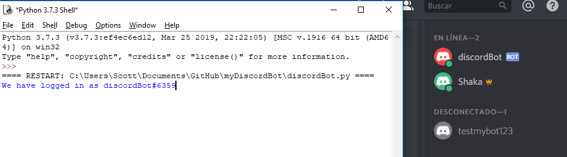

<h1>Discord Bot created with Python</h1>

First the bot must be online, this is done by executing the Python file.
Once it is online, a message is displayed with the username of the bot and it's status (online) in the server:
 
Interacting with the bot is done with commands
